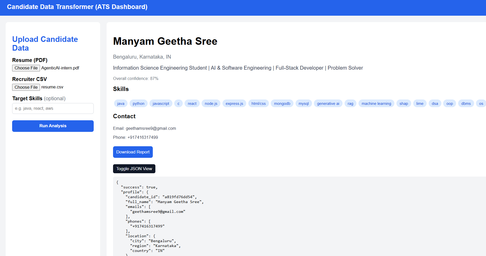
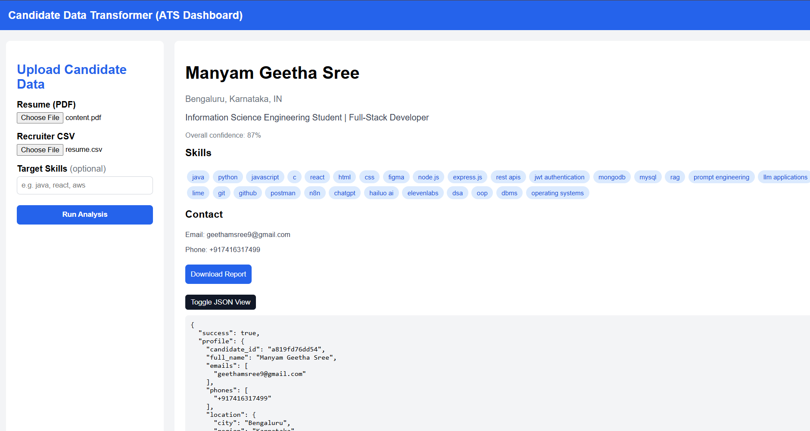

##view problem-statement(design methodology)
[view](ManyamGeethaSree_geethamsree9%40gmail.com_Eightfold.pdf)

## Sample 1



[View JSON Report](../output/sample1/json-report.json)

## Sample 2



[View JSON Report](../output/sample2/json-report.json)

## Install Dependencies

### Server

```bash
cd server
npm install
```

### Client

```bash
cd client
npm install
```

---

## Environment Variables

Create a `.env` file inside the `server` folder.

```env
PORT=5000
GROQ_API_KEY=your_groq_api_key
MODEL=llama-3.3-70b-versatile
```

Replace `your_groq_api_key` with your actual Groq API key.

---

## Run the Project

### Start Backend

```bash
cd server
npm run dev
```

### Start Frontend

```bash
cd client
npm start
```

---

## Upload Endpoint

```
POST http://localhost:5000/api/upload
```

**Content-Type:** `multipart/form-data`

### Sample Config

```json
{
  "fields": [
    {
      "path": "full_name",
      "type": "string",
      "required": true
    },
    {
      "path": "primary_email",
      "from": "emails[0]",
      "type": "string",
      "required": true
    },
    {
      "path": "phone",
      "from": "phones[0]",
      "type": "string",
      "normalize": "E164"
    },
    {
      "path": "skills",
      "from": "skills[].name",
      "type": "string[]",
      "normalize": "canonical"
    }
  ],
  "include_confidence": true,
  "on_missing": "null"
}
```

### Example Request

```bash
curl -X POST http://localhost:5000/api/upload \
  -F "recruiterCsv=@sample-inputs/recruiter.csv" \
  -F "resume=@sample-inputs/resume.pdf" \
  -F "config=@sample-inputs/config.json"
```
